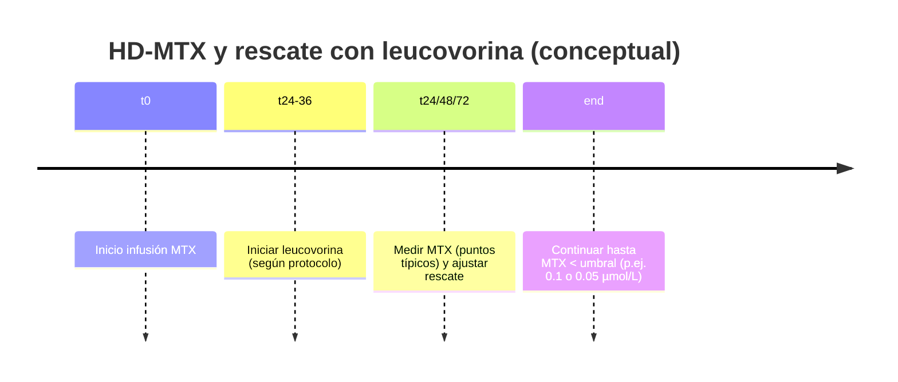

## Brain dump (mapa mental inicial, “sin filtro”)

- **Leucovorina = ácido folínico (folinic acid)**: folato “reducido” que puede entrar al metabolismo de un carbono **sin depender** de la dihidrofolato reductasa (DHFR).   
- **Dos roles clínicos principales (aparentemente opuestos)**:  
  1) **“Rescate”** tras **metotrexato (MTX)** a dosis altas o ante eliminación retardada/sobredosis (protege tejidos sanos).   
  2) **“Potenciación”** de **5‑fluorouracilo (5‑FU)** (aumenta inhibición de timidilato sintasa → más efecto antitumoral y también más toxicidad).   
- **Riesgo crítico que hay que memorizar**: **NO intratecal** (puede ser fatal).   
- **Puntos “pro”/avanzados a dominar**:  
  - Cronología exacta del rescate (horas desde inicio/fin de MTX) + ajuste por **niveles plasmáticos de MTX**.   
  - Soporte para evitar nefrotoxicidad por MTX: **hiperhidratación + alcalinización urinaria**.   
  - Diferencia entre **leucovorina (racémica)** y **levoleucovorina** (isómero activo) y equivalencias de dosis.   
  - Usos “no oncológicos” con evidencia/guías (p. ej., **toxoplasmosis con pirimetamina** para reducir toxicidad hematológica).   

---

# Encabezado de Investigación  
## Leucovorina (ácido folínico): de cero a avanzado — farmacología, usos, dosificación y lectura crítica de la evidencia

> **Aviso educativo (importante):** esto es una síntesis académica para aprender el tema. La **dosificación real** depende del protocolo, laboratorio (ensayo de MTX), función renal y decisiones del equipo tratante.

---

# 1) Introducción al tema

La **leucovorina** (también conocida como **ácido folínico** o “folinato”) es un **análogo de folato** con una particularidad farmacológica clave: puede participar en reacciones de transferencia de un carbono y apoyar la síntesis de nucleótidos **sin requerir** la reducción por **DHFR**, la enzima que bloquea el metotrexato. Esta propiedad explica por qué sirve como **antídoto funcional** (rescate) frente a antifolatos y, en otro contexto, como **biomodulador** que potencia fluoropirimidinas como 5‑FU.   

Desde la perspectiva de metodología de investigación clínica, leucovorina es un buen “caso escuela” porque:  
- En **MTX a dosis altas**, el estándar se apoya en **farmacocinética + monitorización terapéutica** (TDM) y consenso de expertos, más que en RCTs grandes (por ética y logística).   
- En **cáncer colorrectal con 5‑FU**, hay historia de **ensayos clínicos** y comparaciones de regímenes (p. ej., esquemas tipo Mayo) que muestran aumento de respuesta/supervivencia en escenarios paliativos, a costa de toxicidad gastrointestinal/hematológica.   

---

# 2) Desarrollo profundo por apartados (definiciones + ejemplos)

## 2.1 Definiciones esenciales (para construir base sólida)

> **Definición 1 — Leucovorina (ácido folínico):** folato reducido (derivado 5‑formil‑tetrahidrofolato) que puede convertirse en cofactores de folato activos para sostener síntesis de ADN/ARN.   

> **Definición 2 — “Rescate con leucovorina”:** estrategia de administrar leucovorina tras MTX (especialmente a dosis altas) para **replecionar folatos intracelulares** en tejidos sanos y reducir toxicidad, guiada por **niveles plasmáticos de MTX** y función renal.   

> **Definición 3 — “Modulación de 5‑FU”:** uso de leucovorina para aumentar el pool de 5,10‑metilen‑tetrahidrofolato y **estabilizar el complejo inhibidor** de timidilato sintasa generado por metabolitos de 5‑FU, incrementando efecto (y toxicidad) del tratamiento.   

---

## 2.2 Farmacología y mecanismo (nivel intermedio → avanzado)

### A) Leucovorina vs ácido fólico (por qué NO son “lo mismo”)
- **Ácido fólico** requiere pasos enzimáticos para convertirse en formas activas; una pieza crítica de la vía es DHFR.  
- **Leucovorina** “se salta” esa dependencia, por eso puede **rescatar** células cuando DHFR está inhibida por MTX.   

**Idea avanzada (selectividad del rescate):** el rescate es “selectivo” en el sentido práctico de que **protege más** a tejidos normales que al tumor, pero esa selectividad no es mágica: depende de transporte, poliglutamación, tiempos y concentraciones. Por eso, en MTX, el **timing** es tan crítico.   

### B) Potenciación de 5‑FU (la lógica bioquímica del “ternary complex”)
El fundamento clásico (muy citado en farmacología oncológica) es que la inhibición de timidilato sintasa ocurre por un **complejo ternario** (enzima + FdUMP + 5,10‑metilen‑THF). Al aumentar disponibilidad de folato reducido, leucovorina favorece la **formación/estabilidad** de ese complejo, intensificando el bloqueo de síntesis de timidilato (dTMP) y afectando síntesis de ADN.   

**Consecuencia clínica:** más efecto antitumoral, pero también mayor riesgo de mucositis/diarrea y supresión medular cuando se combina con 5‑FU (por eso se insiste en monitorizar toxicidad y ajustar 5‑FU, no leucovorina).   

---

## 2.3 Indicaciones (FDA/guías) y usos frecuentes (incluyendo off‑label con cautela)

### A) Indicaciones típicas (marco regulatorio y monografías)
En formulaciones de leucovorina cálcica inyectable se describen, de forma estándar:  
- **Rescate** tras **MTX a dosis altas** (p. ej., osteosarcoma) y para contrarrestar toxicidad por eliminación retardada o sobredosis de antagonistas del folato.   
- **Combinación con 5‑FU** para tratamiento paliativo de **cáncer colorrectal avanzado** (prolongar supervivencia).   
- **Anemias megaloblásticas por deficiencia de folato** cuando la terapia oral no es posible (y **no** debe usarse para anemia perniciosa por déficit de B12 porque puede “normalizar” sangre mientras progresa daño neurológico).   

### B) Toxoplasmosis con pirimetamina (uso guiado por guías)
En toxoplasmosis (p. ej., encefalitis por *Toxoplasma* en personas con VIH), las guías NIH incluyen leucovorina junto a pirimetamina para **reducir toxicidad hematológica**. Ejemplo (mantenimiento): pirimetamina + sulfadiazina + **leucovorina 10–25 mg VO diarios** (con opciones de subirla en algunos contextos).   
CDC también describe esquemas donde leucovorina acompaña a pirimetamina para mitigar efectos adversos hematológicos.   

### C) Toxicidad por MTX a dosis bajas (evidencia clínica puntual)
En toxicidad grave por MTX de dosis bajas (p. ej., errores de dosificación semanal vs diaria), leucovorina se usa con frecuencia; existe evidencia ensayística comparando dosis (p. ej., 15 mg vs 25 mg cada 6 h) en escenarios de toxicidad severa. Este tipo de estudios es útil para entender que, incluso aquí, la práctica deriva parcialmente por extrapolación del mundo “HD‑MTX” y por urgencia clínica.   

---

## 2.4 Dosificación y administración (lo que más se pregunta en práctica)

### A) Regla de oro de seguridad
- **Nunca administrar leucovorina por vía intratecal.** Se advierte explícitamente por riesgo de daño grave/fatal.   

### B) Rescate tras HD‑MTX: cronología + ajuste por niveles (núcleo del tema)

**1) Cuándo iniciar (principio general)**  
Guías clínicas señalan iniciar rescate típicamente dentro de **24–36 h** desde el inicio de la infusión de MTX (según protocolo) y continuar cada 6 h hasta que el MTX esté por debajo de un umbral (p. ej., 0.1 micromol/L o 0.05 micromol/L si el laboratorio lo reporta).   

**2) Qué monitorizar y en qué tiempos**  
La práctica común (y descrita en revisiones clínicas) es medir MTX plasmático alrededor de **24, 48 y 72 h** (los puntos exactos dependen del protocolo y duración de la infusión), porque esos niveles predicen riesgo de toxicidad y guían intensificación del rescate.   

**3) Tabla de referencia (ejemplo tipo “package insert”)**  
Un esquema clásico de “guías para dosificación” incluye:  
- **Eliminación normal:** leucovorina 15 mg VO/IM/IV cada 6 h por 60 h (10 dosis), iniciando ~24 h tras comienzo de infusión de MTX.   
- **Eliminación retardada / lesión renal aguda:** escalamiento a dosis altas (p. ej., 150 mg IV cada 3 h) hasta que MTX descienda bajo umbrales específicos, y luego pasar a 15 mg cada 6 h.   

**4) Soporte imprescindible (si falla esto, el rescate se vuelve cuesta arriba)**  
- **Hidratación intensa** (p. ej., 2.5–3.5 L/m²/día como orden de magnitud) y  
- **Alcalinización urinaria** para mantener pH ≥ 7, porque MTX precipita en orina ácida y puede dañar túbulos renales → se enlentece su eliminación → sube toxicidad.   

**Ejemplo práctico 1 (escenario didáctico, no prescripción):**  
Paciente en protocolo con HD‑MTX. Se inicia leucovorina 24 h tras inicio de infusión a esquema q6h. A las 48 h, el MTX sigue alto (por encima de lo esperado) y creatinina sube: el equipo intensifica rescate (dosis más altas y/o intervalos más cortos), refuerza hidratación/alcalinización y continúa mediciones seriadas hasta que MTX cae bajo umbral del protocolo. Esta lógica (farmacocinética + toxicidad) es exactamente lo que formalizan guías institucionales y documentos de consenso.   

### C) ¿Qué pasa si hay eliminación muy retardada y se usa glucarpidasa?
En escenarios de lesión renal aguda con MTX muy elevado, se emplea **glucarpidasa** en casos seleccionados; los consensos recomiendan:  
- **Reiniciar leucovorina 2 h después** de glucarpidasa, dosificando según el nivel de MTX previo a glucarpidasa.   
- Mantener rescate al menos 48 h después por el fenómeno de **redistribución** (MTX puede volver desde tejidos al plasma).   

---

## 2.5 Aspectos farmacéuticos (preparación/compatibilidad/velocidad)

- No mezclar leucovorina en la misma infusión con **5‑FU**: se describe riesgo de **precipitado**.   
- En administración IV, se cita una limitación práctica por el **contenido de calcio**: la inyección no debe exceder **160 mg/min** (dato operativo típico en monografías).   
- A dosis orales altas puede haber **biodisponibilidad saturable**; por encima de ciertos rangos (p. ej., >25 mg por dosis en algunos marcos), se considera IV para asegurar exposición adecuada en rescate.   

---

## 2.6 Reacciones adversas e interacciones (lo “difícil” en la vida real)

### A) Con 5‑FU (potenciación = doble filo)
Leucovorina puede aumentar tanto el efecto como la **toxicidad** de 5‑FU, con énfasis clínico en diarrea, mucositis/estomatitis y mielosupresión en regímenes combinados.   

### B) Interacciones relevantes
- **Antiepilépticos**: se advierten posibles cambios con fenobarbital/fenitoína/primidona y riesgo de convulsiones por disminución de niveles (descrito en monografías).   
- **TMP‑SMX para Pneumocystis**: se ha reportado que añadir leucovorina durante tratamiento de *Pneumocystis jirovecii* con TMP‑SMX se asoció con **más fallos** y morbilidad en un estudio controlado (advertencia que aparece en etiquetado).   

---

## 2.7 Leucovorina vs levoleucovorina (isómero activo): implicaciones prácticas

- **Levoleucovorina** es el isómero farmacológicamente activo (“L‑form”) de la leucovorina racémica; su etiquetado y consensos discuten que puede permitir **reducir dosis ~50%** respecto a la forma racémica en contextos equivalentes.   
- Esto también se vuelve relevante por cargas de **calcio/volumen** cuando se requieren dosis muy altas de rescate.   

**Ejemplo práctico 2 (lectura crítica):**  
Si un centro cambia de leucovorina racémica a levoleucovorina por disponibilidad, no basta con “sustituir mg por mg”: la equivalencia es parte del **diseño del protocolo**, y conviene basarse en etiquetado/consenso institucional, especialmente en rescate intensivo.   

---

## 2.8 Metodología: cómo “investigar” leucovorina sin caer en errores comunes

### A) Jerarquía de evidencia por pregunta
- **¿Qué hace y por qué?** → farmacología básica (fuentes tipo monografías académicas, revisiones biomédicas).   
- **¿Cómo dosificar rescate?** → mezcla de etiquetado, guías, TDM, consensos (Delphi/consenso experto), y evidencia observacional (por la ética de randomizar a rescate inadecuado).   
- **¿En toxoplasmosis?** → guías NIH/CDC (síntesis de evidencia + panel experto).   

### B) Señales de alerta de baja calidad (para filtrar fuentes)
- Dosis “exactas” sin contexto de: duración de infusión MTX, unidades (µM vs mg/L), método de medición, umbrales, soporte (pH urinario).  
- Recomendaciones sin citar guías, etiquetas, o consenso.  
Este filtro es crucial porque leucovorina es altamente **dependiente de protocolo**.   

---

# 3) Componente visual (diagramas didácticos)

> Nota: no tengo aquí una herramienta nativa para **generar imágenes rasterizadas** (PNG/JPG) bajo demanda. Para mantener “refuerzo visual” profesional y reutilizable, te dejo **diagramas en Mermaid** (puedes pegarlos en editores compatibles, GitHub, Obsidian, Typora, mermaid.live) y también son legibles como código.

## 3.1 Vía del folato: MTX “bloquea” y leucovorina “puentea”
```mermaid
flowchart LR
  FA[Ácido fólico] -->|DHFR| THF[Tetrahidrofolato (THF)]
  MTX[Metotrexato] --|inhibe| DHFR
  LV[Leucovorina / Ácido folínico] --> THF
  THF --> OneC[Reacciones 1-carbono]
  OneC --> dTMP[dTMP / síntesis ADN]
  OneC --> Pur[Purinas / síntesis ADN-ARN]
```
Fundamento: leucovorina aporta folato reducido funcional pese al bloqueo de DHFR por MTX.   

## 3.2 Potenciación de 5‑FU (complejo ternario en timidilato sintasa)
```mermaid
flowchart TB
  FU[5-FU] --> FdUMP[FdUMP (metabolito activo)]
  LV2[Leucovorina] --> CH2THF[5,10-metilen-THF]
  TS[Timidilato sintasa] --> dTMP2[dTMP]
  FdUMP --- TS
  CH2THF --- TS
  FdUMP & CH2THF & TS --> Complex[Complejo ternario estable]
  Complex -->|inhibición sostenida| dTMP2
```
Idea clave: leucovorina aumenta el cofactor folato necesario para “atrapar” la enzima en el complejo inhibidor.   

## 3.3 Línea de tiempo conceptual (HD‑MTX → rescate)

La práctica se guía por TDM, soporte renal y umbrales definidos por protocolo/ensayo.   

---

# 4) Resumen Ejecutivo (puntos clave)

- Leucovorina (ácido folínico) es un folato reducido que **no depende de DHFR**, lo que explica su papel en **rescate** por antifolatos y su papel de **potenciación** de 5‑FU.   
- En **HD‑MTX**, el rescate es una intervención de **farmacocinética aplicada**: se inicia típicamente 24–36 h (según protocolo), se ajusta por niveles de MTX y se acompaña de hidratación + alcalinización urinaria.   
- Si hay eliminación muy retardada/AKI, puede considerarse **glucarpidasa**; el consenso describe reiniciar leucovorina 2 h después y mantenerla por redistribución.   
- Con **5‑FU**, leucovorina aumenta la inhibición de timidilato sintasa (más eficacia y también más toxicidad).   
- **Nunca intratecal.** No mezclar en la misma infusión con 5‑FU. Respetar límites de velocidad IV por calcio.   
- En **toxoplasmosis** con pirimetamina, guías NIH incluyen leucovorina (p. ej., 10–25 mg/día) para mitigar toxicidad hematológica.   

---

# 5) Glosario de términos (tabla)

| Término | Definición breve |
|---|---|
| Leucovorina / Ácido folínico | Folato reducido (5‑formil‑THF) usado para rescate de antifolatos o potenciación de 5‑FU.  |
| DHFR | Dihidrofolato reductasa; enzima inhibida por MTX.  |
| HD‑MTX | Metotrexato a dosis altas; requiere soporte (hidratación/alcalinización) + rescate.  |
| Rescate con leucovorina | Administración programada/ajustada para disminuir toxicidad por MTX.  |
| TDM | Monitorización terapéutica (niveles plasmáticos de MTX para guiar rescate).  |
| Timidilato sintasa | Enzima dUMP → dTMP; diana clave de 5‑FU.  |
| Complejo ternario | TS + FdUMP + 5,10‑metilen‑THF; base bioquímica de la modulación con leucovorina.  |
| Levoleucovorina | Isómero activo de leucovorina; puede permitir reducir dosis frente a racémica.  |
| Alcalinización urinaria | Mantener pH urinario ≥7 para evitar precipitación de MTX y nefrotoxicidad.  |
| Glucarpidasa | Enzima que degrada MTX; usada en casos seleccionados de eliminación muy retardada/AKI.  |

---

# 6) Cuestionario de autoevaluación (10 preguntas)

1) Explica por qué leucovorina puede “rescatar” toxicidad por MTX incluso cuando DHFR está inhibida.  
2) ¿Cuál es el riesgo principal de seguridad relacionado con la vía **intratecal**?  
3) Describe el mecanismo bioquímico por el que leucovorina potencia 5‑FU (menciona el complejo ternario).  
4) En HD‑MTX, ¿por qué la alcalinización urinaria reduce nefrotoxicidad?  
5) Menciona tres momentos típicos de medición de niveles de MTX usados para guiar rescate.  
6) Si MTX está elevado y hay lesión renal aguda, ¿qué papel tiene glucarpidasa y cómo se coordina con leucovorina (timing)?  
7) ¿Por qué se recomienda **no mezclar** leucovorina con 5‑FU en la misma infusión?  
8) ¿Qué diferencia conceptual hay entre leucovorina racémica y levoleucovorina?  
9) En toxoplasmosis con pirimetamina, ¿qué función cumple leucovorina y qué rango de dosis diaria mencionan guías NIH en adultos?  
10) Nombra una interacción o advertencia clínica importante relacionada con TMP‑SMX y leucovorina.

---

# 7) Clave de respuestas (al final)

## Respuestas
1) Porque leucovorina aporta folato reducido utilizable sin depender de DHFR, reponiendo cofactores intracelulares necesarios para síntesis de nucleótidos.   
2) Puede ser dañino/fatal; está explícitamente contraindicado.   
3) Aumenta 5,10‑metilen‑THF, estabiliza el complejo TS–FdUMP–folato, prolongando la inhibición de TS y disminuyendo dTMP.   
4) MTX precipita en orina ácida; pH ≥7 aumenta solubilidad, reduce precipitación tubular y riesgo de AKI/delayed clearance.   
5) 24, 48 y 72 horas (según protocolo/duración de infusión).   
6) Glucarpidasa se usa en casos seleccionados; leucovorina se reinicia 2 h después y se mantiene por redistribución.   
7) Por riesgo de precipitado / incompatibilidad en la misma infusión.   
8) Levoleucovorina es el isómero activo; permite equivalencias (a menudo ~50% de la dosis de la forma racémica en contextos comparables).   
9) Reduce toxicidad hematológica de pirimetamina; NIH incluye leucovorina 10–25 mg VO diaria (con posibilidad de aumento en algunos casos).   
10) Advertencia: asociada con más fallos/morbilidad cuando se añade durante tratamiento de *Pneumocystis* con TMP‑SMX (según etiquetado).   

---

## Tabla de fuentes (alta calidad; 2 columnas: Nombre y URL)

| Nombre | URL |
|---|---|
| FDA – Leucovorin Calcium Injection (label PDF) | `https://www.accessdata.fda.gov/drugsatfda_docs/label/2012/040347s010lbl.pdf` |
| FDA – KHAPZORY (levoleucovorin) label PDF | `https://www.accessdata.fda.gov/drugsatfda_docs/label/2018/211226s000lbl.pdf` |
| eviQ – Management of high-dose methotrexate toxicity | `https://www.eviq.org.au/clinical-resources/side-effect-and-toxicity-management/prophylaxis-and-treatment/3535-management-of-high-dose-methotrexate-toxicity` |
| Cancer Care Ontario – Leucovorin monograph | `https://www.cancercareontario.ca/en/drugformulary/drugs/monograph/43961` |
| BC Cancer – Leucovorin monograph (PDF) | `https://www.bccancer.bc.ca/drug-database-site/Drug%20Index/Leucovorin_monograph.pdf` |
| Ramsey et al. – Consensus guideline for glucarpidase (The Oncologist, 2018) | `https://academic.oup.com/oncolo/article/23/1/52/6438709` |
| European consensus recommendation on delayed MTX elimination (Springer, 2024) | `https://link.springer.com/article/10.1007/s00432-024-05945-6` |
| StatPearls (NCBI Bookshelf) – Leucovorin | `https://www.ncbi.nlm.nih.gov/books/NBK553114/` |
| Practical issues with high dose methotrexate therapy (PMC) | `https://pmc.ncbi.nlm.nih.gov/articles/PMC4142365/` |
| PubMed – Pharmacologic rationale for fluoropyrimidine–leucovorin combination (1992) | `https://pubmed.ncbi.nlm.nih.gov/1532459/` |
| NIH ClinicalInfo – Toxoplasmosis (Adult/Adolescent OIs) | `https://clinicalinfo.hiv.gov/en/guidelines/hiv-clinical-guidelines-adult-and-adolescent-opportunistic-infections/toxoplasmosis` |
| CDC – Clinical Care of Toxoplasmosis | `https://www.cdc.gov/toxoplasmosis/hcp/clinical-care/index.html` |
| RCT: doses de leucovorina en toxicidad severa por MTX de dosis bajas (PMC) | `https://pmc.ncbi.nlm.nih.gov/articles/PMC10197821/` |
| NCI – Leucovorin Calcium drug page | `https://www.cancer.gov/about-cancer/treatment/drugs/leucovorincalcium` |
